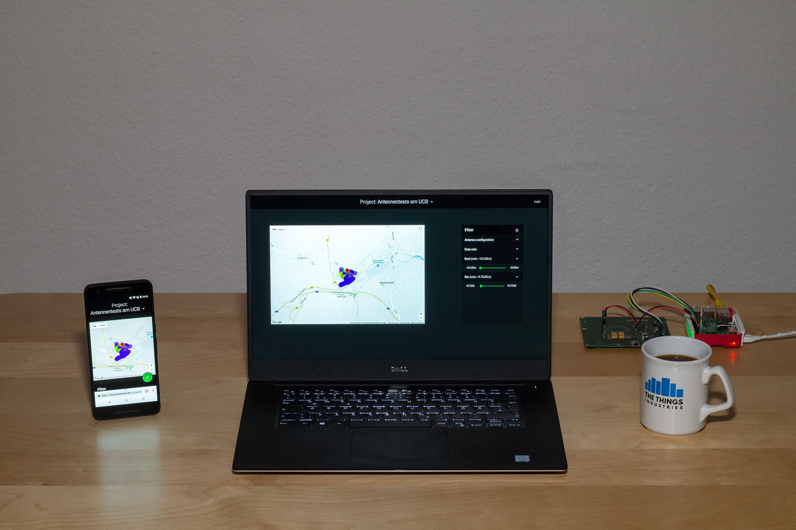
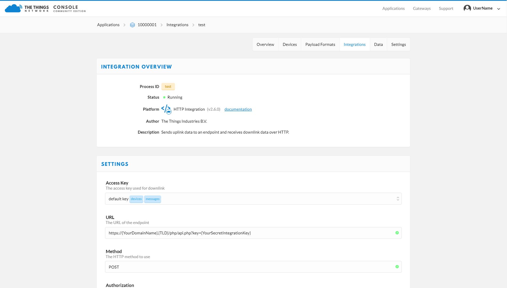

# LoRaWanMapper
Stores the received packages of the [LoRaWanTracker](https://github.com/JulianSchroden/LoRaWanTracker) which have been forwarded by the [The Things Network (TTN)](https://www.thethingsnetwork.org/) and offers a frontend to evaluate the data.

<p align="center">
  
  <p align="center"><em>The responsive LoRaWanMapper frontend</em></p>
</p>

## Table of contents
<!-- toc -->
- [Setup](#setup)
    * [Required services](#required-services)
    * [API to the TTN](#api-to-the-ttn)
        * [Decoder function](#decoder-function)
        * [HTTP Integration ](#http-integration)
- [Frontend](#frontend)
    * [Data filtering](#data-filtering)
    * [Admin panel](#admin-panel)
- [Suggestions](#suggestions)
<!-- tocstop -->

## Setup
To make use of the software your server needs to support PHP and MySQL. Before uploading the files, you need to change the credentials in [LoRaWanMapperConfig.php](php/config/LoRaWanMapperConfig.php) as described in the next subsection.

## Required services
1. Replace the default *username* and *password* with your own login data, which is used to protect the LoRaWanMapper's admin panel.

    ```
    const BACKEND_LOGIN            = ["userName" =>"NAME", "password" =>"MY_PW"];
    ```
2. Go to the [reCAPTCHA admin panel](https://www.google.com/recaptcha/admin#list) and add a new site. Afterwards, you can fill in the *Site key* as the *public* attribute and the *Secret key* as the *private* attribute. The reCAPTCHA widget is used to protect the LoRaWanMapper's admin login from spam.
    ```
    const CAPTCHA_KEYS             = ["public" =>"PUBLIC_KEY", "private" => "PRIVATE_KEY"];
    ```
           
3. Go to the [Maps Javascript API page](https://developers.google.com/maps/documentation/javascript/) and click on "Get a KEY" to request a Google Maps API key.
    ``` 
    const MAPS_KEY                 = "MAPS_KEY";
    ```

4. Replace the HTTP Integration key which protects the [TTN API script](php/api.php) with your own one.
    ```
    const TTN_HTTP_INTEGRATION_KEY = "TTN_HTTP_INTEGRATION_KEY";
    ```
    
5. Set the values in the DATABASE_LOGIN array to the credentials of your database.
    
     ```
     const DATABASE_LOGIN           = ["host" => "HOST", "user" => "USER", "password" => "PW", "dbName" => "DB_NAME"];
     ```
    
### API to the TTN
If you haven't already created a TTN application, visit <https://console.thethingsnetwork.org/applications> and click on "add application". Then you can configure the *Payload Formats* and add an HTTP Integration, which forwards the received packages to the specified server.

#### Decoder function
```
function Decoder(bytes, port) {
  
    // helper function to convert an integer value to a floating point value
    function bytesToFloat(bytes, factor) {
        var number = (bytes[3] << 24) + (bytes[2] << 16) + (bytes[1] << 8) + (bytes[0]);
        return number/factor;
    }  
    
    
    var decoded = {};
    decoded.latitude  = bytesToFloat(bytes.slice(0,  4), 1000000);
    decoded.longitude = bytesToFloat(bytes.slice(4,  8), 1000000);
    decoded.altitude  = bytesToFloat(bytes.slice(8, 12),    1000);
    
    
    return decoded;
}
```

#### HTTP Integration
- Set a process ID of your choice
- Select the default device key as the *Access Key* which is used for downlinks
- Type in your URL and append `/php/api.php?key={YourIntegrationKey}` to it
- Click on "Add integration"




## Frontend
// TODO
### Data filtering

### Admin panel


## Suggestions
The LoRaWanTracker could be improved by:
- Using marker clusters to optimize performance